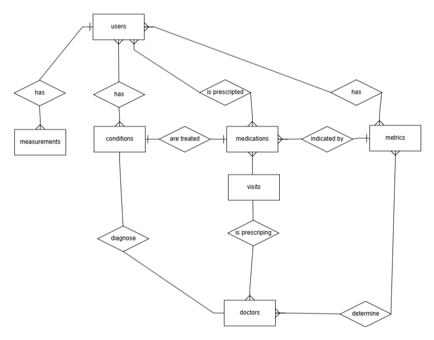

# Design Document

By Michelle Haase

Video overview: <https://youtu.be/DdxJNXxaRFU>

## Scope

The idea behind this database is to help people keep track of their health data. It lets you log body measurements, track medical conditions, manage prescribed meds, keep records of doctor's visits and health metrics like blood pressure and cholesterol.
It covers users, doctors, visits, body measurements, health metrics, diagnosed conditions, and medications. All of these things work together to give you the full picture of your health history and current status.
Some of the things it doesn't cover are things like booking appointments, health insurance, billing and more advanced diagnostic tools. The database can't handle real-time data from wearable devices or multi-user roles and permissions either.

## Functional Requirements

Users should be able to add and manage their personal information, including name, address, age and height. They can log and update body measurements, track various health metrics, record visits to doctors, and view their diagnosed conditions and prescribed medications.
The database should also let users view summaries, such as current medications, health trends over time, and which doctor diagnosed which condition. It makes it easy to link health data to doctors and visits.
There are some features that are outside the scope, like user authentication systems, visual dashboards, notifications or reminders, and integration with external health apps or devices. The database also doesn't support detailed medical imaging, full diagnostic reports, or doctor-side interfaces.

## Representation

### Entities

The main things in the database are Users, Doctors, Conditions, Medications, Measurements, Metrics, and Visits. These are the main parts of a health record.
Each one has carefully selected attributes. For instance, users provide their name, address, age, height and login details. They measure things like weight and circumference. Metrics cover clinical data like blood pressure and cholesterol. The app gives you all the info you need about the meds, like how much, when to take them, and links to the relevant condition and doctor. Visits log the doctor seen, the metrics and the meds.
The Data Types have been chosen for clarity and efficiency: TEXT for descriptive fields, INTEGER for IDs and numeric data, and DATETIME for dates. Constraints like NOT NULL, CHECK, and FOREIGN KEY make sure your data is accurate, stop invalid entries, and keep referential integrity between related entities.

### Relationships

## Optimizations

To make things easier, the database includes a view called condition_details. This view brings together users, conditions, doctors and medications, so you can quickly access a summary table showing which user has which condition, who diagnosed it and what medication they are taking. It makes complex joins easier for common queries.
Indexes are automatically created on primary keys, which helps speed up lookups and joins between related tables. Foreign keys also help to improve the efficiency of queries when filtering or joining by user, doctor, or condition. No additional indexes have been created because the view summarises the data likely to be most frequently queried These optimisations have been chosen to support the most common access patterns, such as retrieving a user's current medications or reviewing their diagnosis history, while keeping the database responsive and well-organised.

## Limitations

One thing to bear in mind with this design is that it doesn't support real-time data tracking from health devices or wearables. You'll need to enter measurements and metrics manually, which might affect how accurate and timely they are in some cases.
The database also doesn't support user roles and permissions, meaning there's no distinction between patient and doctor access. In a real-world system, sensitive medical data would need stricter access control and encryption, which are outside the scope here.
Also, the schema doesn't include detailed medical history like surgeries, allergies, or imaging results. It looks at the main metrics and general health records, so complex cases or hospital workflows might not be covered fully.
